### About Me

- 🧱 Learning frontend fundamentals — HTML, CSS, Sass, BEM methodology
- 🚀 Building real production projects instead of tutorials
- 📈 Long-term path: growing into a fullstack developer

 

### Projects

- 🚢 **BulBulShip** — website for a boat-house rental company. In active development, not public yet.

 

### 🛠️ Stack

### 🌱 Learning Next

 

### 📊 GitHub Stats

 

### 📫 Get in Touch

